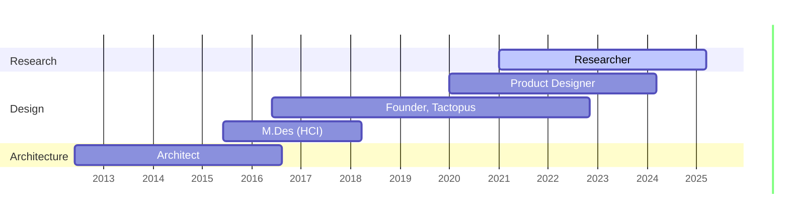

Hi, I'm **Chandni Naidu Deadwyler**. 
Welcome to my website. 
### About Me
*Designer, researcher, writer, artist.*
I'm a systems-thinker with experience working in EdTech, FinTech, and currently research financial inclusion. My research process is artefact-led, driven by realities of technology impact on society. 
Current occupations:
- Founder and primary writer at [Dialectic](https://dialectic.in/). I research, analyse and write data-essays about public-interest topics. You can sign up to the [newsletter](https://dialecticstudio.substack.com/) for updates on upcoming stories.
- Illustrating children's books for [Margazhi](https://margazhi.in/) Publications
- Consulting for data-driven design, research and communication projects.
### Background
Summary of educational and professional background

> [!quote] Art Shop
> Also this is my art shop: [Whalesong](https://whalesong.printify.me/products) 
I create art quite regularly, but update the store sporadically. You can sign up [here](https://whalesongstudio.substack.com/) to be updated on new products.

> [!todo] Daily Notes
> January 2025:
> [[2025-01-02]]
> [[2025-01-03]]
> 
> 
> Planner
> [[Task Dashboard]]

> [!note] Site Notes
> I recently moved my site to an Obsidian-Quartz-GitHub set up, and with it there have been some changes in how I document and share my work. On this site, there's less of the design portfolio content or research case studies. My recent work is better suited for writing in the essay form, both on this website and on [Dialectic](https://dialectic.in/) 

